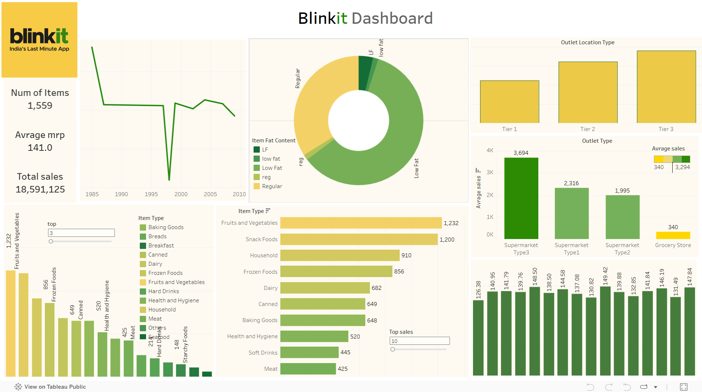

# Blinkit-Dashboard
## 📊 Live Dashboard

Questions for create Dashboard: 
🔗 **[View Interactive Dashboard on Tableau Public](https://fingertips.co.in/cloud2/student/view-material/250)**

Or try direct Tableau Public link if you have it: 
🔗 **[View on Tableau Public](https://public.tableau.com/app/profile/yash.limbasiya/viz/BLINKITDASHBOARD_17502428853380/Dashboard1)**

## Dashboard Preview

## Embedded Dashboard

## 📊 Embedded Dashboard

  <noscript>
    
  </noscript>
  <object class='tableauViz' style='display:none;'>
    <param name='host_url' value='https%3A%2F%2Fpublic.tableau.com%2F' />
    <param name='embed_code_version' value='3' />
    <param name='site_root' value='' />
    <param name='name' value='BLINKITDASHBOARD_17502428853380&#47;Dashboard1' />
    <param name='tabs' value='no' />
    <param name='toolbar' value='yes' />
    <param name='static_image' value='https://public.tableau.com/static/images/BL/BLINKITDASHBOARD_17502428853380/Dashboard1/1.png' />
    <param name='animate_transition' value='yes' />
    <param name='display_static_image' value='yes' />
    <param name='display_spinner' value='yes' />
    <param name='display_overlay' value='yes' />
    <param name='display_count' value='yes' />
    <param name='language' value='en-US' />
  </object>

**Or view directly:**  
🔗 [**Interactive Tableau Dashboard**](https://public.tableau.com/app/profile/yash.limbasiya/viz/BLINKITDASHBOARD_17502428853380/Dashboard1)

